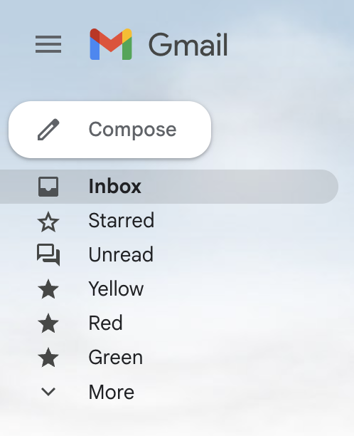
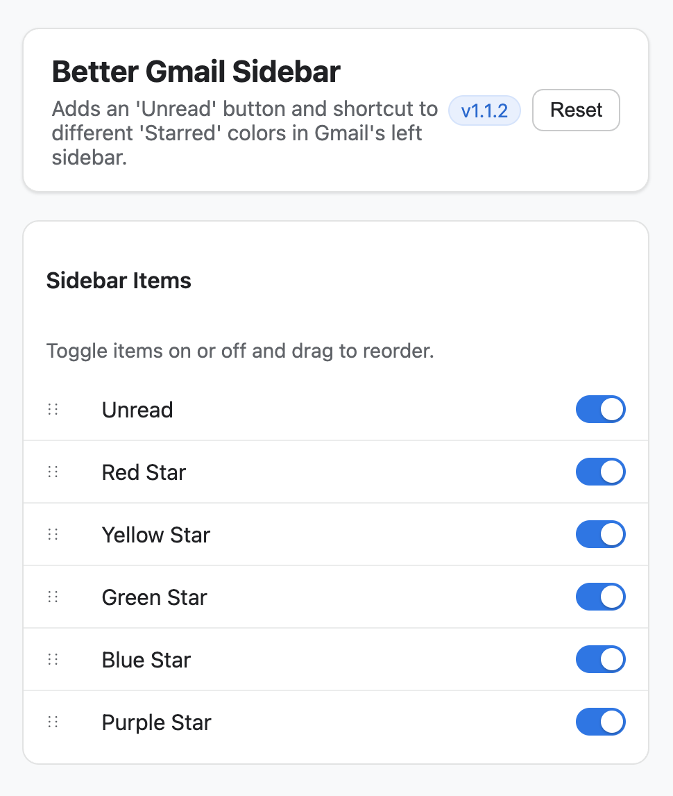

Better Gmail Sidebar

A minimal Chrome extension that adds quick-access rows to the Gmail left sidebar: one for Unread and shortcuts for different Star colors. It blends into Gmail’s UI, is keyboard accessible, and lets you enable/disable and reorder items from an Options page.

Features

- Unread: one-click filter to show unread messages.
- Star colors: shortcuts for Yellow, Red, Green, Blue, and Purple stars.
- Options: Chrome Settings–style page to enable/disable items and drag to reorder; changes apply instantly; includes Reset to defaults. Robust to additional star types.
- Accessibility: rows are focusable and activate via Enter/Space.
- Lightweight resilience: reconciles after navigation changes, settings updates, and shortly after load.
- Minimal permissions: uses `storage` only; runs as a content script on Gmail.
- Toolbar action: click the extension icon to open Options.
- Theming: icon color uses CSS variables and adapts to light/dark for good contrast.

Supported Browser/Site

- Chrome (Manifest V3)
- Gmail at `https://mail.google.com/*`
- Note: Other browsers or sites are not currently supported.

Install (Load Unpacked)

1. Download or clone this repository.
2. Open `chrome://extensions` in Chrome.
3. Toggle “Developer mode” on (top right).
4. Click “Load unpacked” and select the project folder.
5. In the extension’s “Details”, open “Extension options” to configure order and visibility. Changes save automatically.
6. Use drag handles to reorder items; toggle switches to enable/disable.
7. Optional: Pin the toolbar icon; clicking it opens Options.
8. Open Gmail and use the new sidebar rows.

Chrome Web Store Listing

- Short description:
  Adds Unread and Star-color shortcuts to Gmail’s sidebar. Instant options to enable/disable and reorder. No data collection.

- Long description:
  Better Gmail Sidebar adds quick-access rows to Gmail’s left sidebar — an Unread link and shortcuts for different star colors — so you can jump to the messages you care about faster. The Options page (styled like Chrome Settings) lets you enable/disable items and drag to reorder, and changes apply instantly. Keyboard access is built in (Enter/Space), and the extension uses only the minimum permission (`storage`). No analytics, no external network requests, and no data collection.

  Features:

  - Unread: one-click filter to show unread messages
  - Star colors: Yellow, Red, Green, Blue, Purple
  - Options: instant save, drag reorder, Reset
  - Accessibility: focusable rows, Enter/Space activation
  - Minimal permissions; toolbar action opens Options

  Privacy:

  - No data collection or analytics
  - No external network requests
  - Settings stored locally via `chrome.storage.sync`

  Permissions:

  - `storage` (save your options)
  - Host: `https://mail.google.com/*` (run only on Gmail)

Privacy

- No analytics, no external network requests, and no data collection.
- Settings are stored locally via `chrome.storage.sync`.

Troubleshooting

- If rows don’t appear, reload Gmail after installing or saving options.
- If order doesn’t reflect immediately, wait a moment or refresh the page.
- Gmail UI changes can occasionally affect styling/placement; please report issues.

Feedback

- Open an issue with a brief description, steps to reproduce, and your Chrome version.

Screenshots

- Sidebar (Gmail, light theme):

  

- Options (Chrome Settings–style):

  
